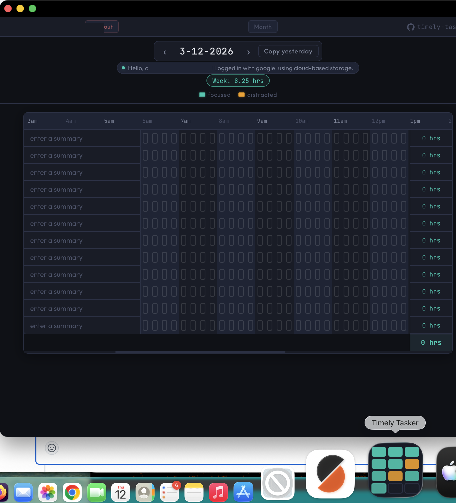

<h1 align="center">⏱ Timely Tasker</h1>

<p align="center">
  <em>Mission control for your day. Track every quarter-hour. Stay on target.</em>
</p>

<p align="center">
  <a href="https://github.com/readysetawesome/timely-tasker/actions/workflows/ci.yml">
    
  </a>
  <a href="https://app.codecov.io/gh/readysetawesome/timely-tasker">
    
  </a>
  <a href="https://github.com/readysetawesome/timely-tasker/issues">
    
  </a>
</p>

<p align="center">
  <a href="https://timely-tasker.com">
    
  </a>
</p>

---

## What is this?

Timely Tasker is a **quarter-hour tick tracker** — a dead-simple grid where each column is 15 minutes of your day. Click a tick to mark it focused 🟦. Click again to mark it distracted 🟨. That's it.

No Pomodoro timers. No AI suggestions. No subscriptions. Just you, a grid, and the truth about where your time went.

Inspired by [David Seah's Emergent Task Timer](https://davidseah.com/node/the-emergent-task-timer/) — the analog paper productivity tool that's been helping people ship things since before smartphones existed.

**→ [Launch the app](https://timely-tasker.com/timer)**

---

## Features

- **Drag to fill** — click and drag across ticks to fill a block of time in one motion
- **Focused / Distracted tracking** — two tick states render in teal and amber so patterns jump out at a glance
- **Week total** — running focused-hours counter so you always know where the week stands
- **Copy yesterday** — clone yesterday's task list as a starting point for today
- **Two storage modes** — sign in with Google for cloud sync, or use local storage with zero login required
- **Installable PWA** — add to your Mac Dock or iPhone home screen for instant daily access
- **Month view** — scan the whole month's tick patterns in one grid

---

## Storage modes

| Mode | How it works | Login required |
|---|---|---|
| ☁️ Cloud | Cloudflare Pages Functions + D1 + Google OAuth | Yes (Google) |
| 💾 Local | Browser `localStorage`, zero network calls | No |

Both modes run the same UI. Switch any time.

---

## Stack

| Layer | Tech |
|---|---|
| Frontend | React 18 + Redux Toolkit + React Router |
| Styling | Tailwind v4 + CSS Modules (SCSS) |
| Edge functions | Cloudflare Pages Functions |
| Database | Cloudflare D1 (SQLite at the edge) |
| Auth | Google OAuth 2.0 / OpenID Connect |
| Tests | Cypress 15 component tests |
| Coverage | `babel-plugin-istanbul` + `@cypress/code-coverage` |
| CI | GitHub Actions + Codecov |
| Deployment | Cloudflare Pages (main → production, branches → preview URLs) |

---

## Auth flow

Google OAuth 2.0 authorization code flow — server-side token exchange, no client-side secrets.

```
browser → /greet → redirect to accounts.google.com
       ← 302 back to /callback?code=...
       → server-to-server POST to Google /token (over TLS)
       ← identity confirmed, httpOnly session cookie set
       → all subsequent XHRs carry cookie automatically
```

- No Google API scopes beyond identity — we only read the `id_token` to establish who you are
- Session cookie is `httpOnly` (invisible to JS) + `SameSite=Lax`
- No JWT validation needed — the server-to-server exchange with Google over TLS guarantees identity

Full sequence: [websequencediagrams](https://www.websequencediagrams.com/cgi-bin/cdraw?lz=dGl0bGUgVGltZWx5IFRhc2tlciBvQXV0aCBsb2dpbiBmbG93CnBhcnRpY2lwYW50IHQAJgUtdAAmBS5jb21cbnN0YXRpYyBhc3NldHMKQWN0b3IgYnJvd3NlcgoKAAIHLT4AGSA6IEdFVCAvCgBBIC0-AFUHOiBIVFRQIDIwMCBSZWFjdCBhcHBsaWNhdGlvblxuIGh0bWwgKyBqcwB5CgAwCWxvYWQAgW4HLQCBbgdyADsICgphbHQgbm8gaHR0cCByZXF1ZXN0IGNvb2tpZQogICAAgVMIAIE8FmVydmVybGVzcyBlZGdlAIFNB2dyZWV0ADcFYWN0aXZhdGUAgjIVAC4OAGcFAEEiLT5hY2NvdW50cy5nb29nbGUuY29tAIJFBy53ZWxsLWtub3duL29wZW5pZC1jb25maWd1cgCCIQUAgQwHAC4RAIE1JnsgLi4uAIQmBgBQBnMuLi4gfQCBDykAghskY3JlYXRlIHNlc3Npb24gc3RhdGVcbgCEZgVtYmxlIGF1dGggdXJsAIIEKQCEMwl7ADcFb3JpemVVcmwgfSArIFNldC1DAINjBTogWwBmDV0AhAgFT25seQCDfQVkZQCDGDAAhX0JAIMTGm8vb2F1dGgyL3YyL2F1dGg_AIFoBT0mc2NvcGU9JmNsaWVudF9pZD0mcmVkaXJlY3RfdXJpPQCFDgVvcHQgc2tpcCBpZiBhbHJlYWR5IGNvbnNlbnRlZCAmIGxvZ2dlZCBpAINsBgCDXRkAhkcSAD4HIHNjcmVlbiAuaHRtAIJmBgCBMyJQT1NUIHN1Ym1pdACIRgYvAEUIdG8gY2xhaW1zAIZKBWVuZACEbhoAh1kSAIhSByBuYXYgLyAAggMIAE8FYWxsYmFjayBVUkwAgR8LAIZ9MgBBCD9jb2RlPS4uLiYAgwUGLi4uAIZsWQCDdgYAhzwHYXBpcwCCOgsvdG9rZW4_AHcIABYVAIhoJgCKKAlqc29uIHdpdGggYWNjZXNzIGFuZCBpZCAAZQUAgxIGAIZ7SERCIHNlbGVjdCBmb3IgZXhpc3RpbmcgaWRlbnRpdHlcbgCMaQZzdWJqZWN0ID09PSBJABYGaWVzLnByb3ZpZGVyAAwHeUkAhCcGb3B0AIgUCG5ldwBECSBpZiBub3QAYAYAhFkGAHxPaW5zZXJ0AIEaCHksIFVzZXIAhTsNABtSVXNlclMAiXwGAIJxKgCOFw4zMDIgTG8AjhYGOgCNVQVzOi8vAI87ES9cbgCJcRRJZF07IEgAiUg6ZWxzZQCOOxQAgxwMAI4fN1xuAIELIgCOIVQAhUgyAI08CGpvaW5lZCB0bwCFegkAjQk0AIVpCQCOagYAgmEvbmQAknofAJE3EACJAgZzdW1tYXJpZXM_Li4uAIJaIACRPywAiBpSAIhXCCt1c2VyIGJ5AJA7CElkACFMAIgHB1MAghAIAIEkJQCVLRJPSyB7IACCVwZ5IH0KAJAxLg&s=default)

---

## Database schema

[Schema diagram](http://htmlpreview.github.io?https://github.com/readysetawesome/timely-tasker/blob/main/public/schema_info.html)

- **Summary** — one row per task per day (label + date + slot index)
- **TimerTick** — one record per occupied quarter-hour slot (`distracted: 0` = focused, `distracted: 1` = distracted)

Tick state encoding: `-1` = empty/deleted, `0` = focused, `1` = distracted.

---

## Local dev

**Prerequisites:** Node 20, `wrangler` CLI, a `.dev.vars` file with local env vars.

```bash
npm install

# Frontend only (no edge functions)
npm start

# Full stack with D1
npx wrangler pages dev --d1=DB --persist -- npm start

# Run migrations
wrangler d1 migrations apply timely-tasker-dev --local   # local
wrangler d1 migrations apply timely-tasker-dev           # preview/staging
bin/migrate-prod-db                                      # !! production !!

# Tests
npm test                          # Cypress component tests
CYPRESS_COVERAGE=true npm test    # with coverage report
npm run lint                      # ESLint

# Local DB console
sqlite3 .wrangler/state/d1/DB.sqlite3
```

---

## Engineering docs

- [ARCHITECTURE.md](./ARCHITECTURE.md) — system design and data flow
- [AGENTS.md](./AGENTS.md) — runbook for engineers and coding agents
- [CLAUDE.md](./CLAUDE.md) — invariants, test conventions, and toolchain notes
